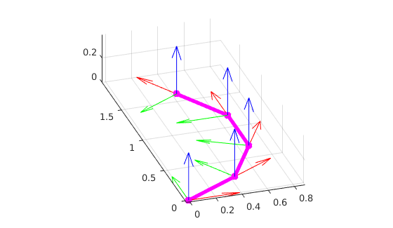
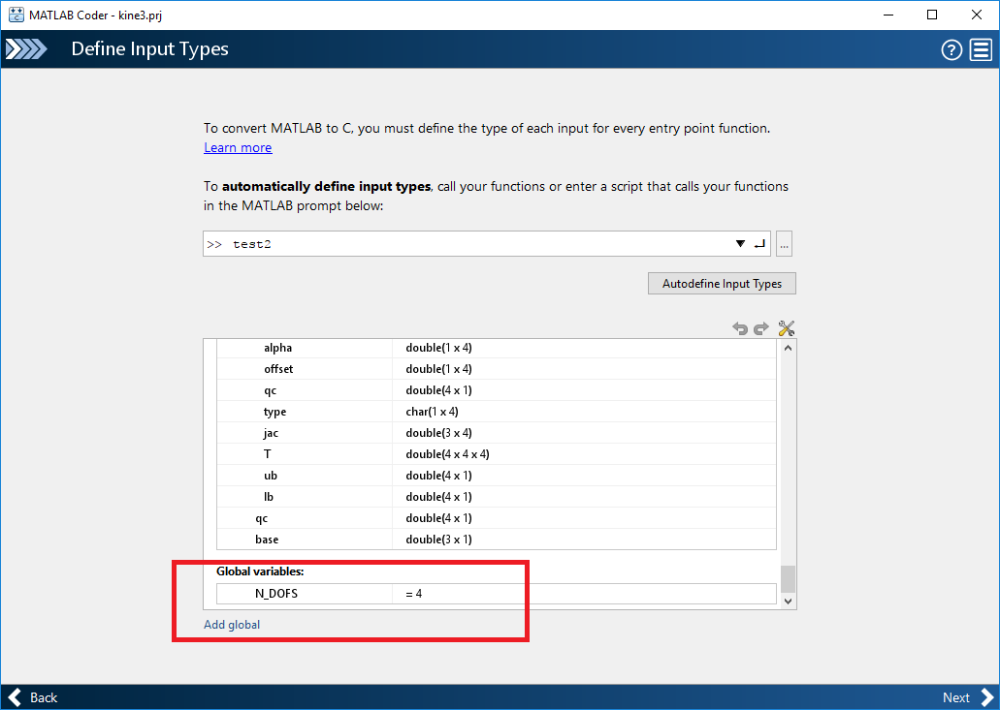

# my-matlab-robotics-toolbox

:pushpin: This repository is useful for quick simulation of robot motions using MATLAB, as it requires little to no setup. For more complex functionalities, one should probably use [Peter Corke's RVC toolbox](https://github.com/petercorke/robotics-toolbox-matlab) instead.

See `demo_*.m` files for some usage examples.

## Table of contents :book:
* [Introduction](#introduction)
    * [Features](#features)
* [How to install](#how-to-install)
* [How to use](#how-to-use)
    * [Demo](#demo)
        * [Upper-limb forward kinematics](#upper-limb-forward-kinematics)
* [How to contribute](#how-to-contribute)
* [Credits](#credits)
    * [Authors](#author)
    * [Contributors](#contributors)

## Introduction
A simple and straightforward implementation of the DH-parameters in MATLAB.

There are two different conventions on the implementation of the DH-parameters. This one uses the standard DH-parameters which can as well be found in [this book chapter](https://www.cs.duke.edu/brd/Teaching/Bio/asmb/current/Papers/chap3-forward-kinematics.pdf). 

The results have been validated with [Peter Corke's RVC toolbox](https://github.com/petercorke/robotics-toolbox-matlab). 

### Features
* Forward kinematics.
* Homogenous transformation of each link of the robot.
* Numerical Jacobian.
* Simple visualization, it can also be animated.
* Inverse kinematics with the pseudo-inverse method and damped least square method.
* Code generation ready.

## Code description :computer:
The repo main elements are:
* [`img`](./img/) folder. Contains the images included in this README.
* [`my-matlab-robotics-toolbox`](./my-matlab-robotics-toolbox/) folder. Contains the core functions implementing the simple robotics toolbox.
> [!NOTE]
> In the `my-matlab-robotics-toolbox` scripts, the following convention applies:
> **cgr** prefix means the code is code-generation ready.    
> **ncgr** means the code is **NOT** code-generation ready.
* `demo_*.m` scripts. The `demo_*.m` files provide a sample usage of the toolbox. The name of the file should be self-explicative of the robot that it implements. These files should be considered the `main` file for out-of-the-box use. 
> [!NOTE]
> You can consider to add your own `demo_*.m` file to the repo. See the [How to contribute](#how-to-contribute) section
* `kine#.prj` files. MATLAB Coder projects examples. Ignore them for basic usage of the package.

### How to install
Install the `my-matlab-robotics-toolbox` package with
```
git clone https://github.com/Luca-Pozzi/my-matlab-robotics-toolbox.git
```

Alternatively, you can download the repo as a `.zip` file and extract it locally.

### How to use
* Create a global variable `N_DOFS` and define the number of degree-of-freedom of the robot in it. The reason why global variable is used is because I keep having problems in using the dynamic memory allocation for MATLAB coder. Therefore, I use global variable to define the dimension of the necessary static arrays.
> [!NOTE]
> The above problem affects you **only** if you are interested in compiling the MATLAB code.
* Create the robot structure with `cgr_create`.
* Actuate and update the joint with `cgr_self_update` functions.
* If necessary, plot the robot with `ncgr_plot` by first calling `ncgr_graphic` once at the beginning of the program.
* To create the compiled MEX or DLL files, two examples of MATLAB Coder project files are provided (`kine#.prj` files). This is where the global variable is used.





#### Demo
##### Upper-limb forward kinematics
TODO.

### How to contribute
TODO.

#### Credits
### Author
- Auralius Manurung, manurunga@yandex.com

### Contributors
- Marta Gandolla, marta.gandolla@polimi.it
- Luca Pozzi, luca.pozzi@polimi.it